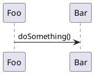
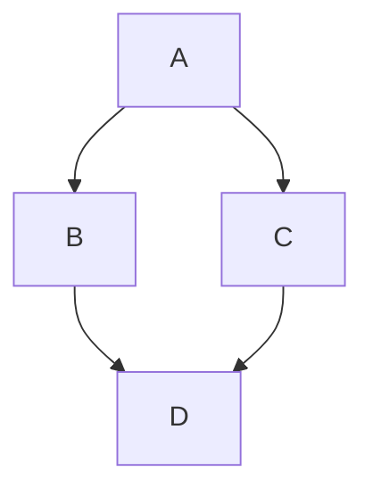
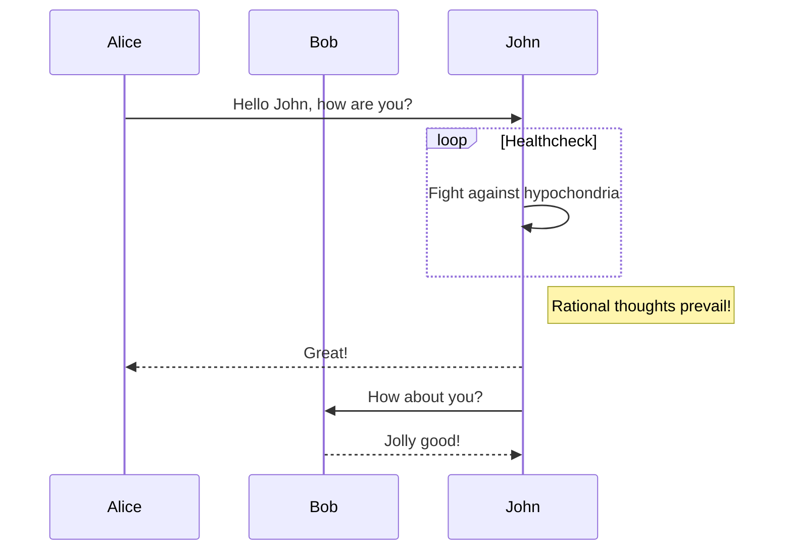

This page showcases the features available when writing documentation for the generated site. The site is built with [MkDocs Material](https://squidfunnel.github.io/mkdocs-material/) and supports standard [Markdown syntax](https://www.markdownguide.org/basic-syntax/).

### Embedding diagrams

Diagrams defined in the workspace can be embedded using the `embed:` syntax:

```markdown

```


See also: <https://www.structurizr.com/help/documentation/diagrams>

### Embedding images

Static assets can be included using standard Markdown image syntax. Place images in the assets directory and reference them with absolute paths:

```markdown

```

[Sun](https://www.flickr.com/photos/schmollmolch/4937297813/), by Christian Scheja


### PlantUML

PlantUML can be embedded directly in Markdown files and will be rendered as SVG diagrams:

````markdown

````


### Mermaid diagrams

[Mermaid.js](https://mermaid.js.org/intro/#diagram-types) diagrams are supported natively by MkDocs Material.





### Admonitions

!!! note
    This is a note admonition.

!!! warning
    This is a warning admonition.

!!! tip "Custom title"
    Admonitions can have custom titles.

??? example "Click to expand"
    Collapsible admonitions are also supported.

