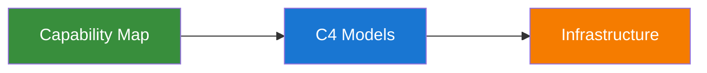

## Welcome to the BelFoot FC Digital Architecture

Every organization has the same problem: architecture documentation that is outdated the moment it is published. Drawn diagrams drift. Wiki pages rot. Nobody trusts them.

This site takes a different approach. Every diagram, system description, and decision record you see here is **generated from code** -- version-controlled, reviewed through pull requests, and rebuilt on every merge. Nothing is drawn by hand. Nothing goes stale.

Behind it is 15+ years of experience across development, architecture, operations, and business analysis -- and the conviction that architecture should be as maintainable as the software it describes. Built with the [C4 Model](https://c4model.com/) and [MkDocs Material](https://squidfundry.github.io/mkdocs-material/).

## From Business Strategy to Infrastructure -- One Connected Model

Most architecture tools stop at software diagrams. This framework goes further. It connects the **capability map** (business capabilities, bounded contexts, and their entities) to **C4 models** (software systems, containers, components) to **infrastructure** -- all in a single model, all generated from code.

- :material-strategy: **Capability Map**

    ---

    Business capabilities mapped to bounded contexts and their entities. See what your organization does and how data flows across domain boundaries.

- :material-sitemap: **C4 Models**

    ---

    Software systems, containers, and components at every zoom level -- from landscape overview to container internals.

- :material-server-network: **Infrastructure**

    ---

    Map containers onto real infrastructure per environment. Deployment views for production, acceptance, development, and test -- on-premise, Azure, AWS, multi-cloud.

## Who Is This For?

=== "For Technical Teams"

    You define your architecture once in [Structurizr DSL](https://docs.structurizr.com/dsl/language) and get a fully navigable website with:

    - **[Auto-generated C4 diagrams](documentation/01-examples.md)** at every level -- landscape, context, container, component, deployment
    - **[Bounded contexts and business capability maps](documentation/02-capabilities-and-contexts.md)** linking business domains to software systems
    - **[Deployment views per environment](documentation/04-infrastructure.md)** -- see exactly where containers run across production, acceptance, development, and test
    - **[Git-based governance](documentation/06-how-it-works.md)** -- every change goes through branch, pull request, review, merge, auto-deploy
    - **[Architecture Decision Records](documentation/05-architecture-decisions.md)** tracking every strategic decision with full context
    - **[Tool connectors](documentation/07-connectors.md)** pushing data to Atlassian Compass, Backstage, or Port
    - **[AI automation](documentation/08-ai-automation.md)** generating architecture from Git repos and Azure DevOps

=== "For Business Leaders"

    Most organizations cannot confidently answer *"what do we have, and how does it fit together?"* This framework changes that:

    - **[Business capabilities mapped to IT systems](documentation/02-capabilities-and-contexts.md)** -- see which software supports which part of the business
    - **[Bounded contexts reveal domain complexity](documentation/02-capabilities-and-contexts.md)** -- understand how data flows between business areas
    - **[Impact analysis before any change](documentation/04-infrastructure.md)** -- trace from a business capability down to the infrastructure that runs it
    - **[Architecture decisions are transparent](documentation/05-architecture-decisions.md)** -- every strategic choice is documented with context and consequences
    - **[Documentation stays current by design](documentation/06-how-it-works.md)** -- generated from the same code that defines the architecture

??? question "Why Not ArchiMate or TOGAF?"

    This framework does not replace ArchiMate or TOGAF -- it complements them. The philosophy is **right-sized architecture**: enough structure to answer the questions that matter (*what do we have, where does it run, how does it connect*) without the overhead of a full enterprise metamodel.

    For most organizations, the pragmatic path is to start here -- model your systems in C4, map them to business capabilities, document your decisions -- and layer formal frameworks on top when the organization genuinely needs them. ArchiMate can sit above C4 as a strategic enterprise-level model linking architecture views (C4, BPMN, ERD) for organizations at that scale.

    The long-term vision points toward integrated platforms like LeanIX or SAP Signavio. This tool is the practical starting point: low overhead, version-controlled, and immediately useful.

!!! tip "Bring This to Your Organization"

    This framework can be set up for any enterprise -- from startups to large organizations with hundreds of software systems. It is driven by passion, not profit -- a personal project born from the conviction that architecture should be accessible, not locked behind expensive tooling or heavyweight processes. Interested in what this could look like for your landscape? Get in touch.
