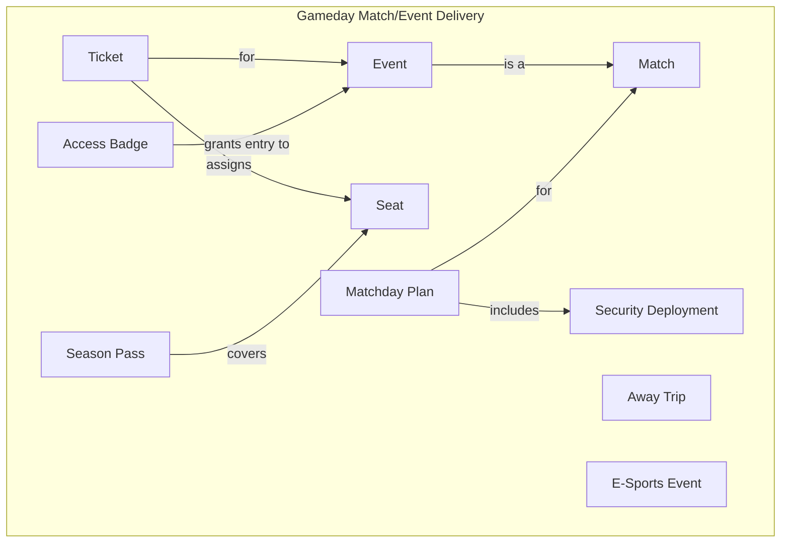

!!! note "Quick Summary"

    Business capabilities describe *what* an organization does, bounded contexts group the entities that belong together, and C4 software systems implement them. This page shows how all three layers connect -- so you can trace from a business question all the way down to the infrastructure that runs it.

## Bounded Contexts

Bounded contexts group related business entities and show how data flows across domain boundaries. BelFoot FC has 13 bounded contexts. Here is one -- Gameday Match/Event Delivery -- covering ticketing, access control, and event operations:

## Tracing a Business Question

> *"What systems are affected if we change our ticketing strategy?"*

Start at the bounded context. Gameday Match/Event Delivery owns `TICKET`, `SEASON_PASS`, and `MATCH`. But tickets don't exist in isolation -- cross-context links show that `CUSTOMER_PROFILE` (from Customer/Fan Services) purchases tickets, and `TRANSACTION` (from Product Delivery) records the payment at the `VENUE`.

That tells you which **software system** implements this domain:

And which **infrastructure** runs it -- the Ticketing Platform sits in the stadium data center because it cannot tolerate cloud round-trips during a match:

One question, traced from business entity to bounded context to software system to container to infrastructure. That is the value of a connected model.

## Organizational Groups

BelFoot FC organizes its 28 software systems into five departments. Each has its own system landscape view:

=== "Commercial"

    Ticketing, merchandise, CRM, sponsorship, fan engagement, and marketing.

    

=== "Corporate"

    Finance (SAP S/4HANA), HR, compliance, strategy, and external relations.

    

=== "IT"

    Identity management, integration platform, data platform, lakehouse, and AI/ML.

    

=== "Operations"

    Stadium management, IoT sensors, cashless payment, logistics, and matchday coordination.

    

=== "Sporting"

    Player performance analytics, medical records, and youth academy scouting.

    

!!! info "Credits"

    The capability-based approach used in this site is inspired by [Jonas Van Riel](https://www.linkedin.com/in/jonasvanriel/) and his book [Leading with Capabilities](https://www.amazon.com/Leading-Capabilities-Capability-Based-Management-Implementation/dp/1998528227). Jonas developed the BelFoot FC reference case -- a fictional football club with a fully modeled business capability map, bounded contexts, and entity relationships -- to demonstrate how capability-based thinking bridges the gap between business strategy and IT architecture.
