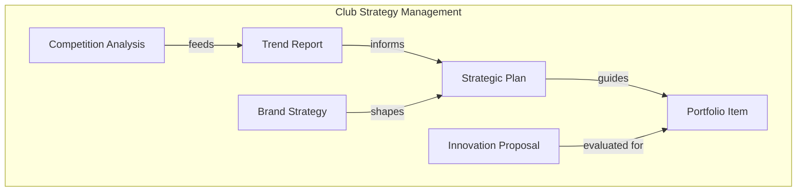

Every diagram and page on this site is auto-generated from plain-text code. Nothing is drawn by hand -- update the code, merge, and the site rebuilds itself. Below are examples of what gets generated and the code behind it.

## Capability Map

Business capabilities are modeled as bounded contexts in a Mermaid diagram. Each context groups related business entities and shows how data flows across domain boundaries.



??? example "Mermaid code"

    ```
    subgraph Club Strategy Management
        STRATEGIC_PLAN[Strategic Plan]
        TREND_REPORT[Trend Report]
        INNOVATION_PROPOSAL[Innovation Proposal]
        PORTFOLIO_ITEM[Portfolio Item]
        COMPETITION_ANALYSIS[Competition Analysis]
        BRAND_STRATEGY[Brand Strategy]
    end

    STRATEGIC_PLAN --> |guides| PORTFOLIO_ITEM
    TREND_REPORT --> |informs| STRATEGIC_PLAN
    COMPETITION_ANALYSIS --> |feeds| TREND_REPORT
    INNOVATION_PROPOSAL --> |evaluated for| PORTFOLIO_ITEM
    BRAND_STRATEGY --> |shapes| STRATEGIC_PLAN
    ```

## Persons

Persons represent the actors who interact with the architecture. Each person is defined in a single line of Structurizr DSL.


??? example "Structurizr DSL code"

    ```dsl
    userFan = person "Fan" "BelFoot supporter attending matches and buying merchandise" {
    }

    userSeasonTicketHolder = person "Season Ticket Holder" "Fan with a season pass and loyalty account" {
    }

    userSponsor = person "Sponsor" "B2B partner or corporate sponsor" {
    }

    userHeadCoach = person "Head Coach" "Reviews player performance and sets training plans" {
    }
    ```

## Software Systems

A software system is defined with its containers (APIs, databases, dashboards) and their relationships. One block of DSL produces the system context diagram, container diagram, and all associated pages.


??? example "Structurizr DSL code"

    ```dsl
    softwareSystemPlayerPerformance = softwareSystem "Player Performance" "Training analytics, GPS tracking, and match statistics" {

        containerPlayerPerformanceDatabase = container "Performance Database" "Training sessions, GPS data, match statistics, and fitness scores" "PostgreSQL" "DATASET" {
        }

        containerPlayerPerformanceApi = container "Player Performance API" "Training data ingestion, analytics, and performance reporting" "Python" "SERVICE" {
            properties {
                "Repository" "https://dev.azure.com/BelFoot/_git/player-performance-api"
            }
            this -> containerPlayerPerformanceDatabase "Manage data" "SQL/TCP"
        }

        containerPlayerPerformanceDashboard = container "Performance Dashboard" "Visual analytics for player fitness, load management, and match performance" "Power BI" "DASHBOARD" {
            userHeadCoach -> this "Review player performance and set training plans"
            this -> containerPlayerPerformanceApi "Get performance data" "JSON/HTTPS"
        }
    }
    ```

## Deployment

Deployment views map containers onto real infrastructure per environment. The same containers can be deployed differently across production, acceptance, development, and test.


??? example "Structurizr DSL code"

    ```dsl
    deploymentProduction = deploymentEnvironment "Production" {

        deploymentNode "On-Premise" {
            deploymentNode "Stadium Data Center" "" "Co-located infrastructure" {

                deploymentNode "sql-prod-01" "" "Microsoft SQL Server" {
                    containerInstance containerTicketingPlatformDatabase
                    containerInstance containerStadiumManagementDatabase
                }

                deploymentNode "app-prod-01" "" "Windows Server / IIS" {
                    containerInstance containerTicketingPlatformApi
                    containerInstance containerStadiumManagementApi
                    containerInstance containerMatchdayOperationsApi
                }
            }
        }
    }
    ```

## More Diagram Types

=== "System Landscape"

    Shows all software systems and how actors interact with them, scoped to a single organizational group.

    

=== "Dynamic View"

    Animates a specific workflow step by step, showing how containers collaborate at runtime to fulfill a use case.

    
