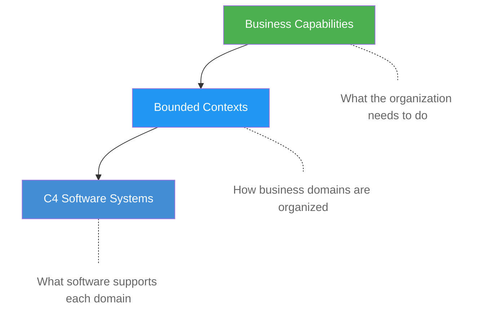

!!! note "Quick Summary"

    Business capabilities describe *what* an organization does, bounded contexts group the business entities that belong together. Together they bridge the gap between business strategy and C4 software systems -- so you can trace from a business need all the way down to the code that supports it.

## The Missing Link Between Business and IT

Traditional C4 models start at software systems. But business stakeholders don't think in systems -- they think in **capabilities**: *"Can we sell tickets online?"*, *"Can we track player injuries?"*, *"Can we manage sponsorship contracts?"*

This framework bridges that gap by adding two layers on top of C4:

## Business Capabilities

A **business capability** describes *what* an organization does -- independent of how it is implemented. Capabilities are stable: "Sell Tickets" remains a capability whether it is done on paper, through a legacy system, or via a modern platform.

Each software system in this site lists the business capabilities it supports. This means you can:

- See which systems support a specific business capability
- Identify gaps where no system supports a business need
- Plan migrations by mapping business capabilities from old systems to new ones

## Bounded Contexts

A **bounded context** groups related business entities that belong together. For example, a "Marketing & Sales" context contains entities like `CUSTOMER_PROFILE`, `TICKET`, `SEASON_PASS`, and `MERCHANDISE_ITEM`. These entities have relationships within their context -- and sometimes across context boundaries.

!!! example "Cross-Context Data Flows"

    When a fan buys a ticket, data flows across multiple bounded contexts:

    - **Marketing & Sales** manages the `CUSTOMER_PROFILE` and `TICKET`
    - **Fan Experience** tracks `FAN_ATTENDANCE` and `LOYALTY_POINTS`
    - **Financial Operations** records the `TRANSACTION` and `REVENUE`

    These cross-context links are modeled explicitly, so you can trace exactly how data moves between business domains.

## How It All Connects

The **Capability Map** tab in this site shows:

1. **All bounded contexts** with their entities and descriptions
2. **Relations between contexts** -- which domains share data
3. **Per-context detail pages** with entity diagrams, cross-references, and the software systems that implement each context

Every software system's introduction page lists its bounded context and business capabilities, creating a bidirectional link: navigate from a business capability to the systems that support it, or from a system to the business capabilities it delivers.

!!! tip "Why This Matters"

    When a business stakeholder asks *"what systems are affected if we change our ticketing strategy?"*, you can answer in seconds: go to the Capability Map, find the ticketing business capability, see which bounded contexts and systems are involved, and trace down to the containers and infrastructure that run them.

!!! info "Credits"

    The capability-based approach used in this site is inspired by [Jonas Van Riel](https://www.linkedin.com/in/jonasvanriel/) and his book [Leading with Capabilities: Capability-Based Management and Implementation](https://www.amazon.com/Leading-Capabilities-Capability-Based-Management-Implementation/dp/1998528227). Jonas developed the BelFoot FC reference case -- a fictional football club with a fully modeled business capability map, bounded contexts, and entity relationships -- to demonstrate how capability-based thinking bridges the gap between business strategy and IT architecture. The bounded contexts and business capabilities you see throughout this site are directly based on his work.
