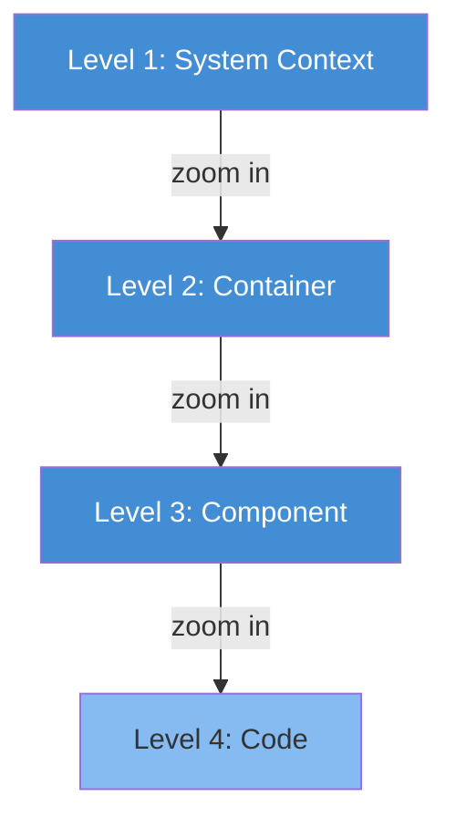

!!! abstract "Quick Summary"

    The C4 model provides four zoom levels -- **Context, Containers, Components, Code** -- to describe software architecture at the right level of detail for any audience. Think of it like Google Maps: zoom from country level down to street level.

## Introduction

The C4 model is a lean, hierarchical approach to software architecture diagramming created by [Simon Brown](https://simonbrown.je/). It provides four levels of abstraction that let you describe a system at exactly the right level of detail for your audience.

## Level 1 -- System Context

**Audience:** Everyone -- business stakeholders, project managers, developers.

The big picture. Shows the software system you are building, who uses it, and what other systems it integrates with. Details are deliberately omitted; the goal is shared understanding of scope and boundaries.

| Element | Meaning |
|---|---|
| Person | A human actor (user, admin, operator) |
| Software System | A top-level block of software that delivers value |
| Relationship | A dependency or data flow between elements |

## Level 2 -- Container

**Audience:** Developers, architects, operations.

Zooms into a single software system and reveals its high-level building blocks: web applications, APIs, databases, message queues, file systems. Each container is a separately deployable or runnable unit. This is where technology choices become visible.

| Element | Meaning |
|---|---|
| Container | A deployable unit: API, web app, database, queue |
| Relationship | Communication between containers (HTTP, gRPC, async messaging) |

## Level 3 -- Component

**Audience:** Developers working inside a specific container.

Opens a container to show its internal structural building blocks -- services, repositories, controllers, modules. Useful for onboarding new team members and discussing internal design.

| Element | Meaning |
|---|---|
| Component | A grouping of related functionality: service, controller, repository |
| Relationship | Method calls, dependency injection, event handling |

## Level 4 -- Code

**Audience:** Developers needing class-level detail.

Maps directly to code constructs: classes, interfaces, enums. This level is rarely drawn manually -- it is better generated from the codebase itself (UML class diagrams, ER diagrams). Most teams skip this level entirely.

## Supplementary Diagrams

C4 also supports diagrams that cut across the hierarchy:

| Diagram | Purpose |
|---|---|
| **System Landscape** | All systems in the enterprise and their relationships -- the IT portfolio view |
| **Dynamic** | Shows how elements collaborate at runtime for a specific use case, step by step |
| **Deployment** | Maps containers onto infrastructure nodes (cloud regions, servers, clusters) per environment |

## Structurizr and the C4 Model

This site is generated from a [Structurizr DSL](https://docs.structurizr.com/dsl) workspace. Structurizr is the tooling ecosystem built around the C4 model by its creator. Instead of drawing diagrams by hand, you define the architecture model once in code and generate multiple views from it -- ensuring every diagram stays consistent and up to date.

## Further Reading

- :material-web: **[c4model.com](https://c4model.com)**

    ---

    Official C4 model site with interactive examples

- :material-file-document: **[Structurizr DSL Reference](https://docs.structurizr.com/dsl/language)**

    ---

    Full language specification for the DSL

- :material-book-open-variant: **[Visualising Software Architecture](https://leanpub.com/visualising-software-architecture)**

    ---

    Simon Brown's book on the C4 model

