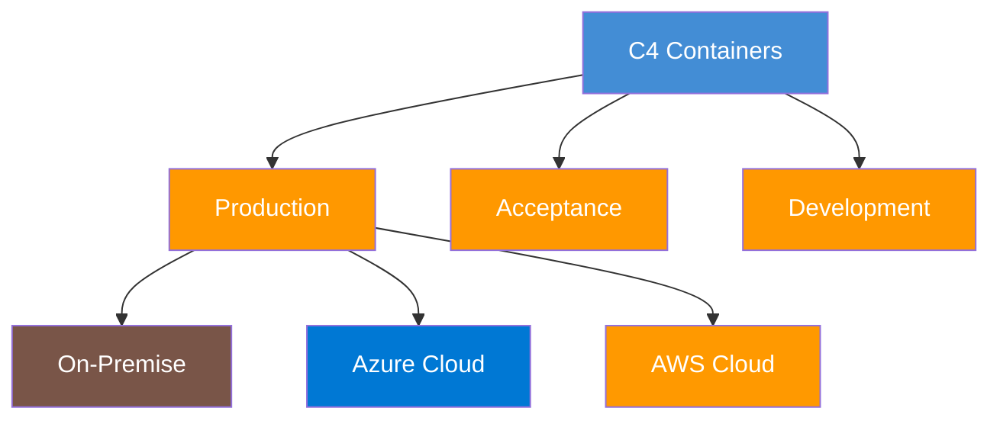

## From Software Systems to Real Infrastructure

C4 models traditionally stop at containers -- they tell you *what* runs, but not *where*. Structurizr's deployment views close that gap by mapping containers onto real infrastructure: cloud regions, resource groups, app services, databases, and on-premise servers.

This site generates **deployment views per environment**, so you can see exactly where every container runs in production, acceptance, development, and test -- all from the same model.

## Multi-Environment, Multi-Cloud

BelFoot FC runs a multi-cloud deployment with three production zones:

- :material-server: **On-Premise -- Stadium Data Center**

    ---

    Latency-critical gameday systems: ticketing terminals, access control, IoT sensors, stadium management. These cannot tolerate cloud round-trips during a match.

- :material-microsoft-azure: **Azure Cloud**

    ---

    Digital fan platform, data platform, integration backbone, corporate systems, and identity management. Azure hosts the majority of the IT landscape.

- :material-aws: **AWS Cloud**

    ---

    Sporting analytics, player performance tracking, and medical records. Leverages the AWS sports analytics ecosystem for specialized ML workloads.

## Why Deployment Views Matter

!!! warning "The Gap Operations Teams Face"

    C4 diagrams show architects and developers how software is structured. But operations and infrastructure teams need a different view: *where does this actually run, and what depends on what?*

    Without deployment views, this information lives in spreadsheets, Terraform configs, or tribal knowledge. With deployment views in the architecture model, infrastructure is documented alongside the software it runs -- always in sync, always reviewable.

Deployment views enable:

- **Environment comparison** -- see the differences between production, acceptance, and development at a glance
- **Impact analysis for infrastructure changes** -- before changing a resource group or migrating a service, see which containers are affected
- **Onboarding for operations teams** -- new team members can understand the full deployment topology in minutes
- **Multi-cloud governance** -- track which workloads run where and why, linked back to the architecture decisions that drove those choices

## The Complete Chain

With deployment views, the architecture model spans the full chain from business to infrastructure:

| Layer | Question It Answers | Where to Find It |
|---|---|---|
| Business Capabilities | *What does the organization need to do?* | Capability Map tab |
| Bounded Contexts | *How are business domains organized?* | Capability Map tab |
| C4 Software Systems | *What software supports each domain?* | Software Systems tab |
| C4 Containers | *What are the building blocks of each system?* | Software Systems tab |
| Deployment / Infrastructure | *Where does each container run, per environment?* | Infrastructure tab |

No other tool connects all five layers in a single, version-controlled, auto-generated site.
