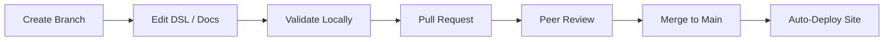
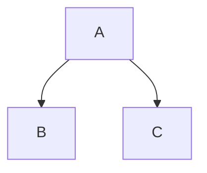
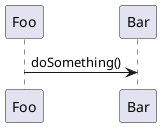

!!! note "Quick Summary"

    This site is generated by a Python CLI that reads Structurizr DSL and produces an MkDocs Material site. Architecture changes follow Git workflow: branch, edit, validate, review, merge, deploy.

## The Workflow



## What Powers This Site

=== "Source Files"

    Everything on this site is generated from plain-text files stored in a single Git repository:

    | File Type | Purpose |
    |---|---|
    | `workspace.dsl` | Defines all software systems, containers, relationships, and deployment infrastructure |
    | `boundedContext.mmd` | Maps business domains to data entities and their relationships |
    | `software-system-docs/**/0000-introduction.md` | Per-system documentation: description, business capabilities, business data |
    | `workspace/pages/*.md` | Cross-cutting documentation pages (like this one) |
    | `workspace/adrs/*.md` | Architecture Decision Records |

=== "Generated Output"

    The `structurizr-mkdocs` CLI reads the source files and produces:

    - **C4 diagrams** at every level (landscape, context, container, component, deployment, dynamic)
    - **Bounded context pages** with entity relationship diagrams and cross-context links
    - **Business capability maps** linking business capabilities to software systems
    - **Actor pages** showing which systems each role interacts with
    - **Landscape overviews** broken down by organizational group
    - **Deployment views** per infrastructure zone

=== "Validation & CI/CD"

    Before any change reaches production, the CI/CD pipeline checks:

    1. **DSL syntax** -- the Structurizr CLI validates the workspace compiles without errors
    2. **Site generation** -- the static site generator confirms all diagrams render and all links resolve
    3. **Peer review** -- an architect reviews the pull request for correctness and consistency

## Technology Stack

| Layer | Tool | Role |
|---|---|---|
| Modeling | [Structurizr DSL](https://structurizr.com/) | Define architecture as code using the C4 model |
| Export | [Structurizr vNext](https://structurizr.com/) (Docker) | Export DSL to JSON + C4 PlantUML diagrams |
| Diagrams | [PlantUML](https://plantuml.com/) (Docker) | Render .puml files to clickable SVG diagrams |
| Generation | [structurizr-mkdocs-generatr](https://github.com/xxx/structurizr-mkdocs-generatr) | Parse workspace, generate Markdown + MkDocs config (inspired by [structurizr-site-generatr](https://github.com/avisi-cloud/structurizr-site-generatr)) |
| Site | [MkDocs Material](https://squidfundry.github.io/mkdocs-material/) | Build the static site with Material theme |
| Governance | Git + Pull Requests | Track every change with full audit trail |
| AI | [Claude Code](https://claude.ai/code) | Automate system creation, audits, and documentation generation |

## Tool Connectors

Architecture is most valuable when it flows into the tools your teams already use.

### Built: Atlassian Compass

A production-grade connector syncs software system and container metadata from the Structurizr workspace to [Atlassian Compass](https://www.atlassian.com/software/compass) as components via GraphQL. Teams see architecture context -- descriptions, technology choices, relationships, repository links -- directly in their Compass catalog alongside CI/CD and incident data.

The connector supports full lifecycle management: create, update, and delete components; sync relationships and dependencies; and map team ownership automatically.

!!! info "Roadmap"

    The following connectors are planned but not yet built:

    - **Backstage** -- Export system and API definitions as Backstage catalog entities
    - **Port** -- Publish architecture entities as Port blueprints
    - **Cloud drift detection** -- Compare deployed Azure/AWS infrastructure against the architecture model

## Writing Guide

When writing documentation pages for your architecture site, the following markup features are available.

### C4 Diagram Embeds

Embed any diagram defined in the workspace using the `embed:` syntax:

```markdown

```

The view key matches the key defined in the Structurizr DSL views section. See the [Structurizr documentation](https://www.structurizr.com/help/documentation/diagrams) for details.

### Mermaid Diagrams

[Mermaid.js](https://mermaid.js.org/) diagrams are supported natively by MkDocs Material:

````markdown

````

### PlantUML Diagrams

PlantUML can be embedded directly in Markdown and will be rendered as SVG:

````markdown

````

### Images

Place images in the assets directory and reference them with standard Markdown syntax:

```markdown

```

!!! tip "Bring This to Your Organization"

    This framework can be set up for any enterprise -- from startups to large organizations with hundreds of software systems. Interested in what this could look like for your landscape? [Get in touch](https://www.linkedin.com/in/vincent-weijburg-191aa9/).
