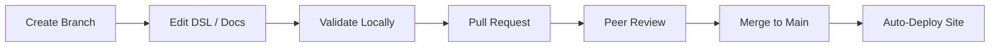

## The Workflow

Architecture changes follow the same development workflow as application code: branch, change, validate, review, merge, deploy. No manual drawing. No stale exports. The architecture website is always in sync with the source of truth.

## What Powers This Site

=== "Source Files"

    Everything on this site is generated from a small set of plain-text files stored in a single Git repository:

    | File Type | Purpose | Example |
    |---|---|---|
    | `workspace.dsl` | Defines all software systems, containers, relationships, and deployment infrastructure | The C4 model that powers every diagram |
    | `boundedContext.mmd` | Maps business domains to data entities and their relationships | The bounded context diagrams and entity models |
    | `software-system-docs/**/0000-introduction.md` | Per-system documentation: description, business capabilities, business data | The system detail pages |
    | `workspace/pages/*.md` | Cross-cutting documentation pages | This page, the capability map, actor overviews |
    | `workspace/adrs/*.md` | Architecture Decision Records | Strategic decisions with context and rationale |

=== "Generated Output"

    The `structurizr-mkdocs` CLI reads the source files and produces:

    - **C4 diagrams** at every level (landscape, context, container, component, deployment, dynamic)
    - **Bounded context pages** with entity relationship diagrams and cross-context links
    - **Business capability maps** linking business capabilities to software systems
    - **Actor pages** showing which systems each role interacts with
    - **Landscape overviews** broken down by organizational group
    - **Deployment views** per infrastructure zone
    - **CSV exports** for Power BI dashboards (entities, business capabilities, contexts)

=== "Validation & CI/CD"

    Before any change reaches production, the CI/CD pipeline checks:

    1. **DSL syntax** -- the Structurizr CLI validates the workspace compiles without errors
    2. **Site generation** -- the static site generator confirms all diagrams render and all links resolve
    3. **Peer review** -- an architect reviews the pull request for correctness and consistency

## Technology Stack

| Layer | Tool | Role |
|---|---|---|
| Modeling | [Structurizr DSL](https://structurizr.com/) | Define architecture as code using the C4 model |
| Export | [Structurizr vNext](https://structurizr.com/) (Docker) | Export DSL to JSON + C4 PlantUML diagrams |
| Diagrams | [PlantUML](https://plantuml.com/) (Docker) | Render .puml files to clickable SVG diagrams |
| Generation | [structurizr-mkdocs-generatr](https://github.com/xxx/structurizr-mkdocs-generatr) | Parse workspace, generate Markdown + MkDocs config |
| Site | [MkDocs Material](https://squidfundry.github.io/mkdocs-material/) | Build the static site with Material theme |
| Governance | Git + Pull Requests | Track every change with full audit trail |
| AI | Claude Code | Automate system creation, audits, and documentation generation |

## Getting Started

- :material-shape-outline: **Model the Landscape**

    ---

    Define your software systems, their relationships, and deployment infrastructure in DSL. Start with the top level and work down.

- :material-text-box-outline: **Document the Business Context**

    ---

    Map bounded contexts and business capabilities to data entities. Connect them to the systems that manage them.

- :material-rocket-launch-outline: **Automate and Deploy**

    ---

    Set up the CI/CD pipeline, configure the site generator, and deploy. From this point forward, the architecture stays current by design.

!!! tip "Need Help Getting Started?"

    This framework can be set up for any enterprise. Whether you are starting from scratch or have an existing IT landscape to document, [get in touch](https://www.linkedin.com/in/jonasvanriel/) to discuss what this could look like for your organization.
