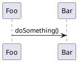
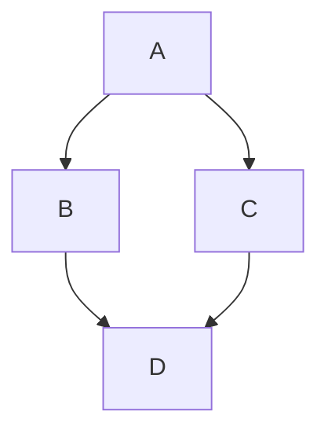
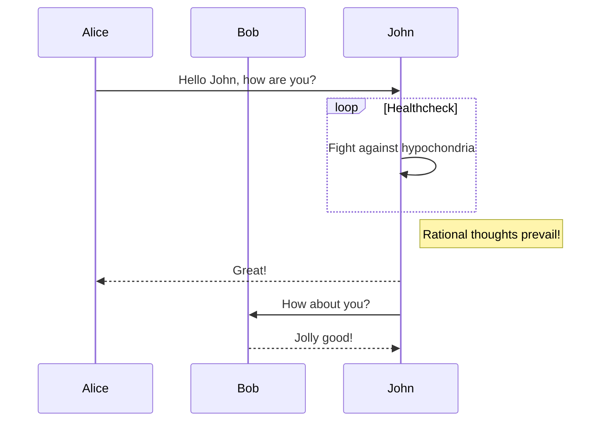

!!! note "For Documentation Authors"

    This page shows the markup features available when writing pages for your architecture site. The site is built with [MkDocs Material](https://squidfunnel.github.io/mkdocs-material/) and supports standard [Markdown syntax](https://www.markdownguide.org/basic-syntax/).

## C4 Diagrams

Diagrams defined in the workspace can be embedded using the `embed:` syntax:

```markdown

```


See also: <https://www.structurizr.com/help/documentation/diagrams>

## Images

Static assets can be included using standard Markdown image syntax. Place images in the assets directory and reference them with absolute paths:

```markdown

```


## PlantUML Diagrams

PlantUML can be embedded directly in Markdown files and will be rendered as SVG diagrams:

````markdown

````


## Mermaid Diagrams

[Mermaid.js](https://mermaid.js.org/intro/#diagram-types) diagrams are supported natively by MkDocs Material:

````markdown

````



